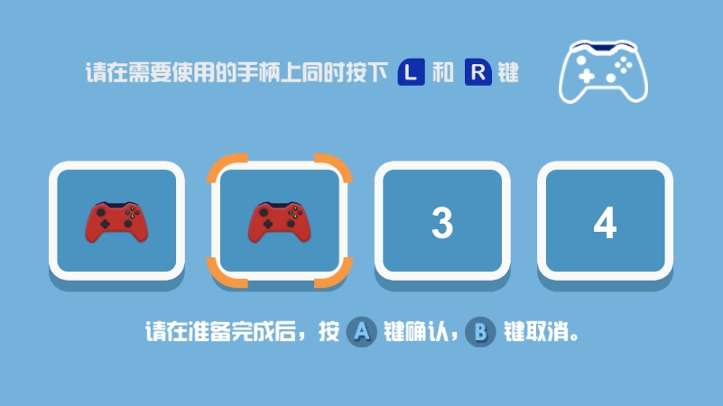

# Xbox手柄调度模块
## 预览

## 开始使用
### 1）Editor > ProjectSettings > Player > OtherSettings > ActiveInputHanding 选项设置为【InputSystemPackage】或者【Both】
### 2) Window > PackageManager 中确定已安装InputSystem
#### 2.5)可以使用以下两种方法之一安装本包。

    1.Window > PackageManager > 左上角+号 > add package from git URL 输入
    git+https://github.com/LinZhiWeiNB/XBoxControllerSortForUnity
    -优点：可以通过PackageManager快速更新本包
    -缺点：需要安装git

    2.直接在github中下载zip压缩包，解压后放在项目的packages目录中

### 3）在Project面板中的Packages列表里找到【Xbox手柄调度模块】> Runtime > Prefabs 中的预制体【XboxControllerManager】拖入场景中。
    注：【XboxControllerManager】预制体默认包含一个向Display0渲染的UI界面，如果项目包含多个Display，可以复制并修改Canvas的TargetDisplay设置。
### 4）在需要使用手柄排序界面的时候调用以下代码
```csharp
Reborn.XboxController.ControllerManager(int PlayerNum);
```
### 5）在需要监听手柄按键时调用以下相关函数
```csharp
using Reborn.XboxController;

//按键按下时
ControllerManager.Instance.GetKeyDown(XboxControllerKey key, int playerIndex);

//按键抬起
ControllerManager.Instance.GetKeyUp(XboxControllerKey key, int playerIndex);

//按键按住
ControllerManager.Instance.GetKey(XboxControllerKey key, int playerIndex);

//轴的数值
ControllerManager.Instance.GetAxisValue(XboxControllerKey key, int playerIndex);

//水平轴数值
ControllerManager.Instance.GetHorizontalValue(int playerIndex, bool isLeftStick);

//垂直轴数值
ControllerManager.Instance.GetVerticalValue(int playerIndex, bool isLeftStick);

//设置马达震度速度，仅pc生效
ControllerManager.Instance.SetMotorSpeeds(float left, float right, int playerIndex);

//清除所有马达震动
ControllerManager.Instance.ClearAllMotorSpeed();


//额外功能
ControllerManager.Instance.RealIndex //存储了真实手柄顺序，比如第0个玩家目前使用的手柄索引即 RealIndex[0] 可以由此推测玩家使用的屏幕
```
